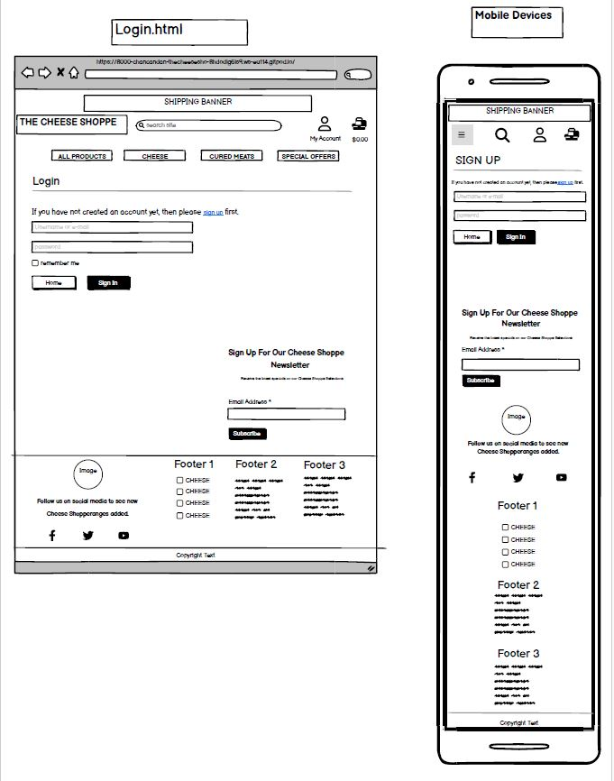

<div align="center">
  
</div>
<div align="center">
  
</div>

[The Cheese Shoppe](https://the-cheese-shoppe.herokuapp.com/) is an online store specialising in a wide variety of cheeses, cured meats, and gourmet products. Designed as a comprehensive e-commerce platform, it seamlessly integrates Stripe for secure and effortless payment processing. The website features a cohesive and captivating theme, showcasing meticulous attention to detail and highlighting the extensive skills developed throughout the project.

## Table of Contents
1. <details open>
    <summary><a href="#ux">UX</a></summary>

    <ul>
    <li><details>
    <summary><a href="#goals">Goals</a></summary>

    - [Visitor Goals](#visitor-goals)
    - [Business Goals](#business-goals)
    - [User Stories](#user-stories)
    </details></li>

    <li><details>
    <summary><a href="#visual-design">Visual Design</a></summary>

    - [Wireframes](#wireframes)
    - [Fonts](#fonts)
    - [Icons](#icons)
    - [Colors](#colors)
    - [Images](#images)
    </details></li>
    </ul>
</details>

2. <details open>
    <summary><a href="#features">Features</a></summary>

    <ul>
    <li><details>
    <summary><a href="#page-elements">Page Elements</a></summary>

    - [All Pages](#all-pages)
    - [Home Page](#home-page)
    - [Product Page](#product-page)
    - [Cheese Page](#hampers-page)
    - [Cured Meat Page](#gifts-page)
    - [Special Offers Page](#special-offers-page)
    </details></li>

    <li><details>
    <summary><a href="#additional-features">Additional Features</a></summary>

    - [Image Loading Blur](#image-loading-blur)
    - [Email](#email)
    </details></li>

    <li><details>
    <summary><a href="#future-ideas">Future Ideas</a></summary>

    - [Basic](#basic)
    - [Content](#content)
    </details></li>
    </ul>
</details>

3. <details open>
    <summary><a href="#technologies-used">Technologies Used</a></summary>

    - [Languages](#languages)
    - [Frameworks](#frameworks)
    - [Libraries](#libraries)
    - [APIs](#apis)
    - [Platforms](#platforms)
    - [Other Tools](#other-tools)
</details>

4. <details open>
    <summary><a href="#testing">Testing</a></summary>

    <ul>
    <li><details>
    <summary><a href="#methods">Methods</a></summary>

    - [Validation](#validation)
    - [General Testing](#general-testing)
    - [Mobile Testing](#mobile-testing)
    - [Desktop Testing](#desktop-testing)
    </details></li>

    <li><details>
    <summary><a href="#bugs">Bugs</a></summary>

    - [Known Bugs](#known-bugs)
    - [Fixed Bugs](#fixed-bugs)
    </details></li>
    </ul>
</details>

5. <details open>
    <summary><a href="#deployment">Deployment</a></summary>

    <ul>
    <li><details>
    <summary><a href="#local-deployment">Local Deployment</a></summary>

    - [Local Preparation](#local-preparation)
    - [Local Instructions](#local-instructions)
    </details></li>

    <li><details>
    <summary><a href="#github-deployment">Github Deployment</a></summary>

    - [Github Preparation](#github-preparation)
    - [Github Instructions](#github-instructions)
    </details></li>
    </ul>
</details>

6. <details open>
    <summary><a href="#credit-and-contact">Credit and Contact</a></summary>

    - [Content](#content)
    - [Contact](#contact)
</details>

----

# UX
## Goals
### Visitor Goals
- The target audience for Wexfordd Treasures are:
- Individuals seeking premium and unique gift options for special occasions.
- Customers looking for visually stunning and curated hampers to impress recipients.
- Gourmet enthusiasts exploring a diverse selection of high-quality food and beverage hampers.
- Gift givers seeking convenient online shopping with secure payment options.
- Visitors interested in discovering the story and craftsmanship behind each curated hamper collection.

User goals are:
- Browse a gallery of beautifully curated hampers for various occasions.
- Discover unique and themed hampers to suit different tastes and preferences.
- Easily contact the seller or customer support for inquiries or assistance with purchases.
- Access detailed product descriptions and specifications to make informed buying decisions.
- Follow the journey and inspiration behind each hamper collection, including the stories and craftsmanship involved.

Wexford Treasures fills these needs by:
- Featuring captivating visuals of our hampers, enticing exploration.
- Showcasing an extensive gallery of hampers on the product page.
- Offering seamless communication with a prominent "Email" link in the footer.
- Integrating social media for updates and behind-the-scenes content.
- Providing a seamless review submission process, allowing customers to share their thoughts and recommendations with others.


### Business Goals
The Business Goals of Wexford Treasures are:
- Showcase and emphasize the uniqueness of our range of cheese.
- Grow the subscriber base through an engaging newsletter.
- Facilitate seamless communication channels for customer inquiries and support.
- Enhance brand visibility and engagement through active social media presence.
- Provide accessible pathways for customers to purchase our products.

### User Stories
User Stories for The Cheese Shoppe:
- As a shopper, I expect to discover a diverse range of harder to find cheeses for various occasions.
- I expect the products to be prominently featured, allowing me to easily explore different collections and types.
- As a gourmet enthusiast, I look forward to exploring new cheeses inspired by different cuisines and premium ingredients.
- As someone seeking gift inspiration, I expect to find informative details about each cheese's contents and presentation.
- As a customer interested in purchasing a cured meat, I expect to find a convenient way to contact customer support for inquiries or assistance.
- I anticipate learning about the stories behind each type of cheese, providing insight into the craftsmanship and inspiration behind the products.
- As someone who enjoys staying updated, I look forward to following The Cheese Shoppe on social media for the latest product launches, promotions, and behind-the-scenes glimpses.
- I expect to receive timely updates and exclusive offers from The Cheese Shoppe through their social media channels.
- If I decide to make a purchase, I expect to easily find information on how to place an order and complete the transaction.

## Visual Design
### Wireframes

- I used Balsamic to create wireframes in the planning and prepartion stages of developing The Cheese shoppe. They be found below and are titled within the images themselves.


#### Index Wireframe
<div align="center">
  
</div><br><br>

#### Products Wireframe
<div align="center">
  
</div><br><br>

#### Register Wireframe
<div align="center">
  
</div><br><br>

#### Login Wireframe
<div align="center">
  
</div><br><br>

#### Wishlist Wireframe
<div align="center">
  
</div><br><br>

#### Contact Us Wireframe
<div align="center">
  
</div><br><br>

#### My Account Wireframe
<div align="center">
  
</div><br><br>

#### Shopping Bag Wireframe
<div align="center">
  
</div><br><br>

#### Checkout Wireframe
<div align="center">
  
</div><br><br>


### Fonts
<br>
<div align="center">
  
</div><br>

- The primary font Lato was chosen because of its modern and clean aesthetic, which aligns perfectly with the sophisticated yet approachable brand image of The Cheese Shoppe. Lato, designed by Łukasz Dziedzic, offers excellent readability with its semi-rounded details and strong structure, making it versatile for both digital and print use. Its neutrality and elegance ensure that the focus remains on the content, whether it's product descriptions, blog posts, or user interfaces. Furthermore, Lato's wide range of weights allows for flexible design applications, from bold headlines to subtle body text, enhancing the overall user experience on the site. This choice reflects our commitment to providing a seamless and enjoyable browsing experience for our customers, reinforcing the quality and professionalism of The Cheese Shoppe brand.

### Icons
<br>
<div align="center">
  
</div><br>
<br>

Icons sourced from the Font Awesome Icon library are implemented as classes within the <i> tag.
- Because these icons are utilised as classes, they can be effortlessly styled using other classes or IDs within the same tag. 
- Bootstrap classes are frequently employed to ensure uniform styling. 
 

### Colors
<br>
<div align="center">
  
</div><br>
<br>
- While it might look at first glance like little effort was put into the colour palette choices, it was quite the opposite. I wanted a clean, modern, and elegant look for the site and to let the colour yellow in every cheese stand out on the site, so I felt choosing this colour palette would achieve this. The yellow colour in the palette image above was in anticipation of the yellow from the cheese images being prominent on the site.

The colours #222222, #FFFFFF, #000000, and #212529 were carefully chosen to create a harmonious and sophisticated visual experience:

#222222 (Dark Gray): This dark gray coluor provides a strong, neutral backdrop that adds depth and sophistication to the website. It is less harsh than pure black, making it easier on the eyes for background use while still ensuring text and images stand out clearly.

#FFFFFF (White): White is the ultimate neutral colour that signifies cleanliness and simplicity. It creates a sense of openness and space on the website, allowing other elements, especially the vibrant yellow from the cheese images, to stand out without overwhelming the viewer.

#000000 (Black): Black is used to provide high contrast, making text and other important elements easily readable. It adds a touch of elegance and authority to the site, balancing the overall aesthetic.

#212529 (Near Black): This nearly black shade is slightly softer than pure black, adding subtlety and depth to the design. It works well for text and headers, providing excellent readability and a modern look without the starkness of true black.

Together, these colours create a cohesive and visually appealing design that highlights the key elements of the site, especially the cheese products, while ensuring a pleasant user experience.

I used coolors.co to help created my colour pallette for the The Cheese Shoppe


### Images
<br>
<div align="center">
  
</div><br>

- The cheese collage about made with https://www.photocollage.com/


- The Cheese Shoppe website prominently features high-resolution images of cheese hampers to showcase their quality and presentation, enticing visitors with their visual appeal.
- Cheese products are elegantly presented in a responsive grid layout, ensuring an optimal viewing experience across various devices and screen sizes.
-Visitors can view cured meat in detail by clicking on small images, opening the images in a much larger view.
-The website dynamically adjusts image spacing within columns, ensuring a balanced and visually pleasing product view layout, contributing to an engaging user experience that encourages exploration.

----

# Features
## Page Elements
### All Pages
#### Navbars (Main and Mobile)
<div align="center">
  <br>
  <br>
  <br>
  
</div><br>
<br>

- The Navbar is simple, providing only four options containing All Products, Cheese, Cured Meat and Special Offers to maintain the minimalist style.
- The Logo and Heading remains to the left, they are removed to suit smaller devices to leave more space for my dropdown nav.
- On smaller devices, the menu becomes collapsible.
- The mobile nav button has been placed to the left for ease of use with one hand.
- Logged-in users see their account logo and shopping bag balance to the right for quick access to personal and shopping information


#### Toasts
<br>
<div align="center">
  
</div><br>
<br>

- Bootstrap toasts were incorporated to deliver customers with notifications regarding their interactions on the website.

#### Footer
<div align="center">
  <br>
  <br>
  <br>
  
</div>

- Located at the bottom of every page, it includes a cheese image, social media links, three headings containing Make your own hampers with useful links, then the most popular category heading contains links to Wexford Treasures best, and finally it contains Contact Info as the last heading.
- The headings all stack for responsiveness.
- Social media logos brings users to Wexford Treasure on social media for the latest product launches, promotions, and behind-the-scenes glimpses


### Home Page

<div align="center">
  
</div>

- This is the home page, where every detail is crafted with my experience in mind. 
- As soon as you land on the  website, you're greeted with a captivating background image carefully selected to engage users senses and set the tone for their journey. 
- The streamlined navbar ensures effortless navigation, allowing users to explore the site's products with ease.
-  At the heart of the page, the prominent heading stands proudly next to the Cheese Shoppe text logo, inviting users to discover the essence of the brand. 
- For users ready to embark on their shopping adventure, a centrally located "Explore Our Ranges" button calls users, ready let them explore the exquisite range of products.


### Sign Up Page
<div align="center">
  
</div>

### Sign In Page
<div align="center">
  
</div>

### Sign Out Page
<div align="center">
  
</div>

#### Products Page
#### Cheese
#### Cured Meat
#### Special Offers Page
<div align="center">
  
</div>

<div align="center">
  
</div>

- The product, cheese, cured meat, and special offer pages on our website boast a cohesive and user-friendly design.
- Each page showcases our diverse range of offerings in a consistent layout featuring four columns, ensuring an organized and visually appealing display.
- Designed to be responsive, the layout seamlessly adjusts to suit all devices, from desktops to mobile phones, providing an optimal viewing experience for every user.

### Product Detail Page
<div align="center">
  
</div>

### Review
<div align="center">
  
</div>

- Authenticated users can utilise the reviews section to submit feedback for a product.


### Product Management Page
<div align="center">
  
</div>

### Shopping Bag Page
<div align="center">
  
</div>

### Checkout Page
<div align="center">
  
</div>

### Checkout Success
<div align="center">
  
</div>

---


## Models

User data is securely managed within a relational database. The core framework has been thoughtfully designed to include features such as product management, order processing, feedback collection, secure card detail storage, and a display of our extensive selection of cheeses, cured meats, and cheese boards:

- UserLogInEntry: Each row represents an entry recording the login activity of users on the website.
- Permission: Each row denotes a specific permission granted to users, dictating their access level within the system.
- Product Category: Each row categorizes products, providing organisation and navigation for users browsing the shop.
- Product Wishlist: Each row represents a product that a user has added to their wishlist for future consideration or purchase.- User Wallet: Each row stores information about the wallet or virtual currency balance associated with a user's account.
- Product Review: Each row captures a user's review or feedback on a purchased product, aiding other users in their decision-making process.
- Email Address: Each row stores the email addresses associated with user accounts for communication and identification purposes.Place Order: Each row signifies an order that has been initiated by a user, awaiting confirmation and fulfillment.
- Checkout: Each row records the successful completion of an order transaction, indicating that payment has been processed and products are ready for shipment.


---


## Additional Features


### Email
- Mailchimp is functional on every page through the newsletter form.


## Future Ideas
### Basic
- Another section above the newsletter such as testimonials.
- An upgrade on the database, some styling added


### Content 
- A wider range of products and images.
- Blog posts on the website for making your own hampers.

----


### Email
- Mailchimp is functional on every page through the newsletter form.


## Future Ideas
### Basic
- Another section above the newsletter such as testimonials.
- An upgrade on the database, some styling added


### Content 
- A wider range of products and images.
- Blog posts on the website for the user making their own cheese sets.

----

# Technologies Used
## Languages
- HTML5
- CSS3
- JavaScript
- jQuery
- Bootstrap
- Python
- Django

## Frameworks
- [Bootstrap4](https://getbootstrap.com/)
    * Used for basic styles and outline.

## Libraries
- [Google Fonts](https://fonts.google.com)
    * Font Styles.
- [Fontawesome](https://fontawesome.com/)
    * Used for icons


## Platforms
- [Github](https://github.com/)
    * Storing code remotely and deployment.
- [Gitpod](https://gitpod.io/)
    * IDE for project development.

## Other Tools
- [Balsamiq](https://balsamiq.com/)
    * To create wireframes.
- [Favicon Generator](https://www.favicon-generator.org/)
    * Favicons
- [Canva](https://www.canva.com/)
    * Platform for images.
- [Coolors](https://coolors.co/)
    * Creating color pallettes.

----


## Testing
Testing documentation can be found [here.](TESTING.md)


## Search Engine Optimization SEO and Marketing

### SEO
- Descriptive meta tags were added to the main template, including title, description and keywords.
- A sitemap was generated using [xml-sitemaps](https://www.xml-sitemaps.com/) This was generated using the deployed website. The file is included in the root level of the project.
- Robots.txt file was created at the root level of the project. This file tells the search engine crawlers which URLs they can access on the website.


### Marketing
- A newsletter section is featured across the site, enriching user engagement and elevating the store's profile through compelling content and effective SEO practices.

- Facebook Page<br>
<br>
(https://www.facebook.com/profile.php?id=61560026431789)
<br>
<br>
<div align="center">
  
</div>

<div align="center">
  
</div>

<div align="center">
  
</div>

<div align="center">
  
</div>


# Deployment
## Local Deployment
### Local Preparation
**Requirements:**
- An IDE of your choice, such as [Visual Studio Code](https://code.visualstudio.com/)
- [Git](https://git-scm.com/)
- You will have to set up a connection with an email server through EmailJS:
- You will have to install SASS to compile the CSS. This depends on your system and your method choice. Please see the instructions [here](https://sass-lang.com/install).

### Local Instructions
1.  You can clone the repository with:
    ```
    git clone https://github.com/chancandan/the_cheese_shoppe
    ```
    To disconnect it from the master repository, use:
    ```
    git remote rm origin
    ```
2. Open your IDE and choose the base directory.
3. Here you can install SASS with npm, if you choose, with:
    ```
    npm install -g sass
    ```
4. Run the compiler with:
    ```
    sass --watch assets/css/bootstrap_sass:assets/css
    ```
    This will also watch the bootstrap_sass folder for changes and re-compile the CSS when they are made. This way you can make changes quickly and not worry about re-compiling.
6. Switch the user token for EmailJS with your own. It can be found in the head tag:
    ```
    (function () {
        emailjs.init("<your user token>");
    })();
    ```
5. Run the project with your chosen method. You can drop index.html into a web browser and it should run fine, open a local port and access it or, if you have python installed, run it on an HTTP server with python with a command such as:
    ```
    python3 -m http.server
    ```

## Github Deployment
### Github Preparation
- It is possible to copy or clone the repository directly for deployment, but you will have to compile to make sure the SCSS compiles correctly first. Github Pages' Jekyll themes support this but you will have to make some customisations. Details can be found [here](https://jekyllrb.com/docs/assets/).
**Requirements:**
- A free GitHub account.

### Github Instructions
1. Log in to your GitHub account.
navigate to [https://github.com/chancandan/the_cheese_shoppe](https://github.com/chancandan/the_cheese_shoppe).
1. You can set up your own repository and copy or clone it, or you fork the repository.
2. `git add`, `git commit` and `git push` to a GitHub repository, if necessary.
3. GitHub pages will update from the master branch by default.
4. Go to the **Settings** page of the repository.
5. Scroll down to the **Github Pages** section.
7. Select the Master Branch as the source and **Confirm** the selection.
8. Wait a minute or two and it should be live for viewing.

## Credits and Contact
### Content
Nearly all text content was generated by the AI, GPT-4. Especially for product descriptions.
Most of my Images were screenshots of cheese items across sites such as (https://www.pexels.com) and then I also used Canva.
I used screenshots but then always made sure to change to title and description of products and made up random prices.


### Acknowledgements

The tutors are code institue, in particular Thomas and also Roo, thanky uo guys so much for your help.