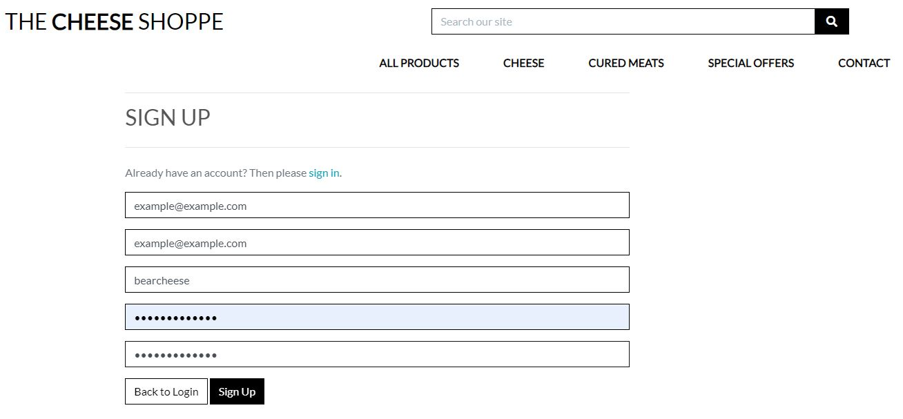
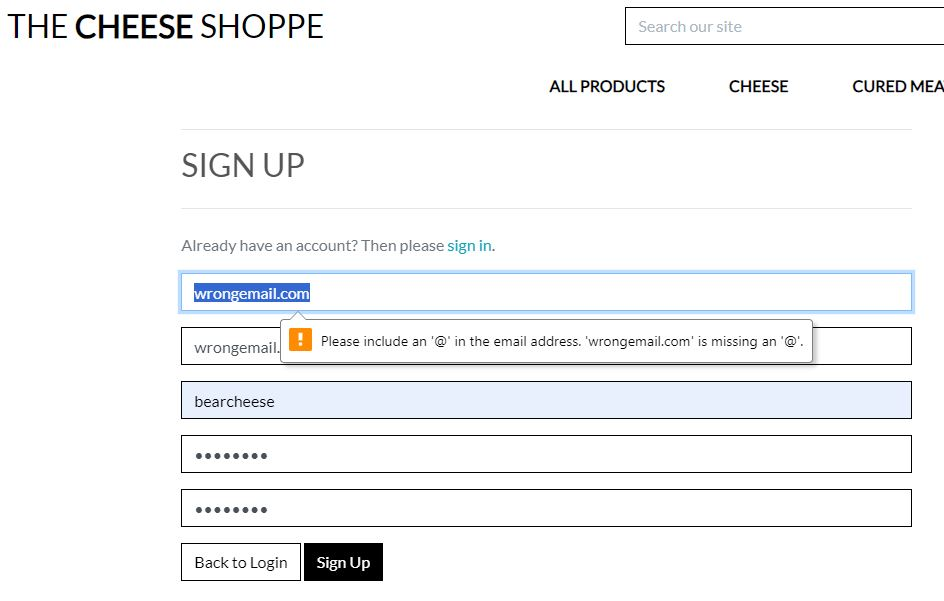

## Testing

### Manual testing

1. As a Shopper / Site User, I want to create an account so that I can access my order history and save my preferences.

**Acceptance Criteria** | **Accomplished** | **Screenshot** |
| ------------ | ------------ | ------------ |
| Registration form with required fields (name, email, password) | YES |  |
| Validations for email format and password strength | YES |  |
| Unique email address requirement | YES |  |
| Account creation upon successful registration | YES |   |
| Access to order history after login | YES |  |

2. As a Shopper / Site User, I want to Log in and Logout so that I can access my account and saved information and keep my information secure when not using 

**Acceptance Criteria** | **Accomplished** | **Screenshot** |
| ------------ | ------------ | ------------ |
| Visible "Log In" option on homepage | YES |  |
| Login form with username/email and password fields  | YES |  |
| Error message for incorrect credentials  | YES |  |
| Successful login redirects to authenticated view  | YES |  |
| Display user's name or profile picture when logged in  | YES |  |
| Access to account info (order history, addresses)  | YES |  |
| Visible "Log Out" option when logged in  | YES |  |
| "Remember Me" option for persistent login  | YES |  |
| Logout confirmation screen  | YES |   |
| Session timeout for security  | YES | Times out after 5 mins of inactivity |
| Thorough testing on various devices and browsers  | YES |     |

4. As a Shopper / Site User, I receive email verification email after registration to establish account creation.

|  **Acceptance Criteria** | **Accomplished** | **Screenshot** |
| --- | --- | --- |
| Email verification requirement | YES |   |

5. As a Shopper / Site User, I can save billing info to my profile for faster future checkouts.

  **Acceptance Criteria** | **Accomplished** | **Screenshot** |
| --- | --- | --- |
| Users can save billing details during checkout. | YES |  |
| Users can still edit billing details during checkout. | YES |  |

6. As a Shopper / Site User, I can update the profile to change shipping information

| **Acceptance Criteria** | **Accomplished** | **Screenshot** |
| --- | --- | --- |
| Users can access their profile settings. | YES |  |
| Edit and update shipping information in the profile. | YES |  |
| Confirm changes with clear notifications. | YES |  |
| Provide error handling for profile updates. | NO| No required fields as user is allowed to not save their info to their profile if they wish however phone number can be letters currently which is an issue |
| Ensure compatibility across devices and browsers. | YES |   |

7. As a Shopper / Site User, I can view order history to keep track of past purchases.

| **Acceptance Criteria** | **Accomplished** | **Screenshot** |
| --- | --- | --- |
| Users can easily access their order history. | YES | |
| Order history displays past orders with dates, order numbers, and item details. | YES |  |
| Users can click to view more order details. | YES |  |
| Works well on different devices and browsers. | YES |   Alert message can be clicked away to clearly see content  |

9. As a Shopper / Site User I want to understand immediately the purpose of the site so my time is not wasted

| **Acceptance Criteria** | **Accomplished** | **Screenshot** |
| --- | --- | --- |
| Clearly convey the site's purpose on the homepage through images and design that reflects the vintage/retro theme | YES |  |
| Offer a user-friendly interface with intuitive navigation to browse and purchase vintage clothing items | YES |  |

10. As a Shopper / Site User, I want to include a navbar so I can easily access all parts of the site from any page

| **Acceptance Criteria** | **Accomplished** | **Screenshot** |
| --------------------------- | ----------------- | -------------- |
| Prominent navbar that matches theme  | YES  |  |
| Positioned at the top for easy access | YES   |  |
| Includes functional links to each page | YES | Each link in navbar is working correctly |
| Mobile-friendly menu for smaller screens  | YES    | issues with gaps beside screen - minimal benefit to fixing and within timeframe decided to leave as did not affected functionality of website. Ideally I would have bag icon and account display i9hn nav header and not in toggle side bar again, left as did turn out to be more complicated to fix that the benefit it gave to users  |
| Logo/site name links to the homepage  | YES    |   |
| Fixed navbar for easy access while scrolling  | YES    |  |

11. As a Shopper / Site User, I can access social links in the footer section of the site.

| **Acceptance Criteria** | **Accomplished** | **Screenshot** |
| --- | --- | --- |
| Social links are clearly visible in the footer. | YES |  |
| Links lead to the respective social media profiles. | YES |    |
| Links open in a new tab or window for user convenience. | YES |   |
| The footer design ensures easy access on all devices. | YES |   |

12. As a Shopper / Site User I want to see my login status so I know if I am logged in or not

**Acceptance Criteria** | **Accomplished** | **Screenshot** |
| ------------ | ------------ | ------------ |
| Visible username under account icon when user logged in | YES |  |
| Toast success messages appear when user logs in/logs out | YES |   |
| Thorough testing on various devices and browsers | YES |  |

13. As a Shopper / Site User, I can receive notifications of actions through a toast to know if actions are successful.

14. As a Shopper / Site User I want to browse products so i can see the products available 

| **Acceptance Criteria** | **Accomplished** | **Screenshot** |
| --- | --- | --- |
| Display a grid or list of available products. | YES |   |
| Include clear product images, names, and prices. | YES |  |
| Implement filters or categories for easy navigation. | YES |    |
| Enable sorting options (e.g., by price, by condition). | YES |  |
| Pagination or infinite scrolling for large product catalogs | NO | Will not apply as only limited number of products added |
| Responsive design for mobile users. | YES |  |
| Clickable product cards to view more details. | YES |   |
| Provide a search bar for specific product searches. | YES |  |
| Fast loading times for product pages. | YES | Used web.p images for quicker loading |

15. As a Shopper / Site User, I can view high-quality images of vintage items to examine their condition and details.

| **Acceptance Criteria** | **Accomplished** | **Screenshot** |
| --- | --- | --- |
| Include clear product images, names, and prices. | YES |  |

16. As a Shopper / Site User I want to view my bag and total cost from any page on site so i can be aware of total cost of bag as I am browsing

| **Acceptance Criteria** | **Accomplished** | **Screenshot** |
| --- | --- | --- |
| Display a visible bag icon or link on all site pages | YES |  |
| Show the current total cost of items in the bag | YES |  |
| Update the total cost as users add/remove items | YES |   |
| Ensure responsive design for mobile and desktop | YES |    |

17. As a Shopper / Site User, I can view individual product details by clicking to make more informed purchase decisions.

| **Acceptance Criteria** | **Accomplished** | **Screenshot** |
| --- | --- | --- |
| Users can click on a product to view its detailed information. | YES |  |
| Product details include images, description, price, size and condition. | YES |  |
| Users can easily navigate back to the product list from the product details page. | YES |    |

18. As a Shopper / Site User, I can CRUD product reviews to help users and myself make informed purchases on similar products.

| **Acceptance Criteria** | **Accomplished** | **Screenshot** |
| --- | --- | --- |
| Users can create new product review of bought product by providing a rating and written comments when logged in. | YES |    |
| Validated form for rating numbers | YES |  |
| Users can view and edit their own product reviews if they are logged in. | YES |   |
| Users can delete their own product reviews if needed. | YES |  |
| Toasts | YES |   |

20. As a Shopper / Site User I want to filter products by category so I can narrow down my search results and easily find items that interest me. 

| **Acceptance Criteria** | **Accomplished** | **Screenshot** |
| --- | --- | --- |
| Implement filters or categories for easy navigation. | YES |    |
| Provide clear and easy-to-use filter controls. | YES | As above |
| Display relevant filter options based on available products. | YES | Filter by catgegory and gender displaying relevant producst - issues with skirts and dresses displaying for men categories however no products will display and hence will be a future fix as dies not affect functionality of product category sorting |
| Include appropriate labels and descriptions for each filter. | YES | As above |
| Ensure responsive design for mobile and desktop users. | YES |      |

21. As a Shopper / Site User I want to sort items by price, by condition (low to high and vice versa) so I can quickly find what I'm looking for

| **Acceptance Criteria** | **Accomplished** | **Screenshot** |
| --- | --- | --- |
| Implement sorting options for price (low to high and high to low) | YES |     |
| Implement sorting options for the condition of clothes (low to high and high to low) | YES |     |
| Display clear and easy-to-use sorting controls | YES |    | |
| Maintain consistency in sorting across all product categories | YES |   |
| Ensure responsive design for mobile and desktop users | YES |    |

23. As a Shopper / Site User, I can search for a product by name, description or keywords to find a specific product.

| **Acceptance Criteria** | **Accomplished** | **Screenshot** |
| --- | --- | --- |
| Users can enter keywords, product names, or descriptions into the search bar. | YES |   |
| The search function returns relevant products that match the entered keywords. | YES |   |

24. As a Shopper / Site User I want to add items to my bag so I can keep track of what i want to buy and have total added up

| **Acceptance Criteria** | **Accomplished** | **Screenshot** |
| --- | --- | --- |
| Include an "Add to Bag" or "Add to Cart" button on each product | YES |   |
| Allow users to click this button to add items | YES |  |
| Provide a visual confirmation of the added item | YES |  |
| Enable easy adjustments (removal only in our case) | YES |  |
| Show the current total cost of items in the bag | YES |  |
| Update the total cost as users add/remove items | YES |   |
| Ensure responsive design for mobile and desktop | YES |    |

26. As a Shopper / Site User, I can use a card as the payment method to complete the purchase.

28. As a Shopper / Site User I want to view items in my bag so I can be aware of what I am buying and it's cost

| **Acceptance Criteria** | **Accomplished** | **Screenshot** |
| --- | --- | --- |
| Allow users to click the bag icon to view its contents | YES |     |
| Enable easy adjustments (removal only in our case) | YES |  |
| Provide a summary of items with names, quantities, prices, and subtotals | YES | As above |
| Display a visible bag icon or link on all site pages | YES |  |
| Show the current total cost of items in the bag | YES |  |
| Update the total cost as users add/remove items | YES |   |

30. As a Store Owner / Admin, I can manage product listings by adding, editing, or removing products from the catalog.

| **Acceptance Criteria** | **Accomplished** | **Screenshot** |
| --- | --- | --- |
| adding through admiin | YES |  |
| editing through admiin | YES |  |
| deleting through admiin | YES |  |